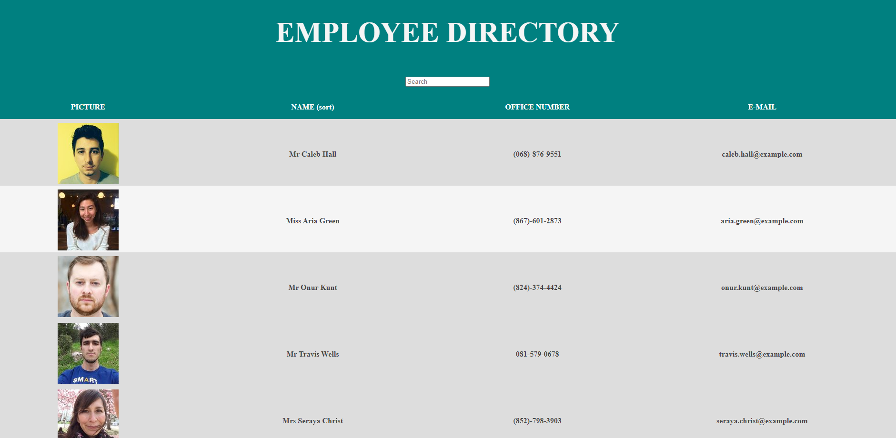

# Employee Directory 

This application allows users to view all employees in a simple and clean interface. The top features a banner, which can be modified based on an individual company's needs. The search functional allows users to search for employees based on employee criteria. The table below displays all employees and their details. 

## Highlights

* Databases can be modified to remove/add columns as needed
* Users can search for employees based on criteria
* Employees can be filtered alphabetically through the name category
* Content is laid out on a single page for easy viewing

### Website UI

### Future Development
* The search functionality is currently not fully functioning
* I utilized an API to gather dummy employee data, I would like to create a functionality for users to create and add in their own data

### Contact

For any questions, comments or suggestions, please contact me at madeline.cowell@colorado.edu

### View more of my work
[Github/MadelineCowell](https://github.com/MadelineCowell)